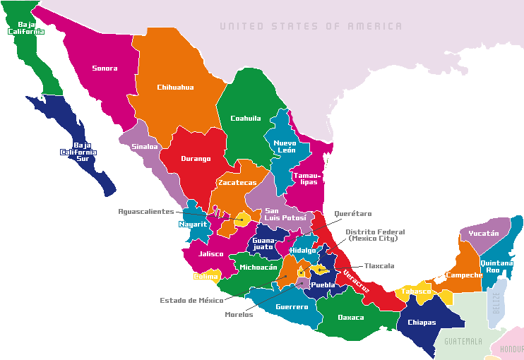
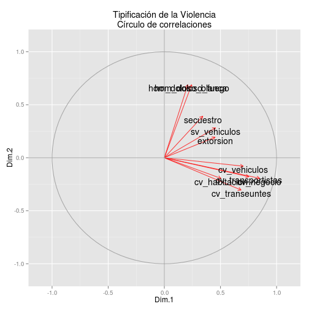
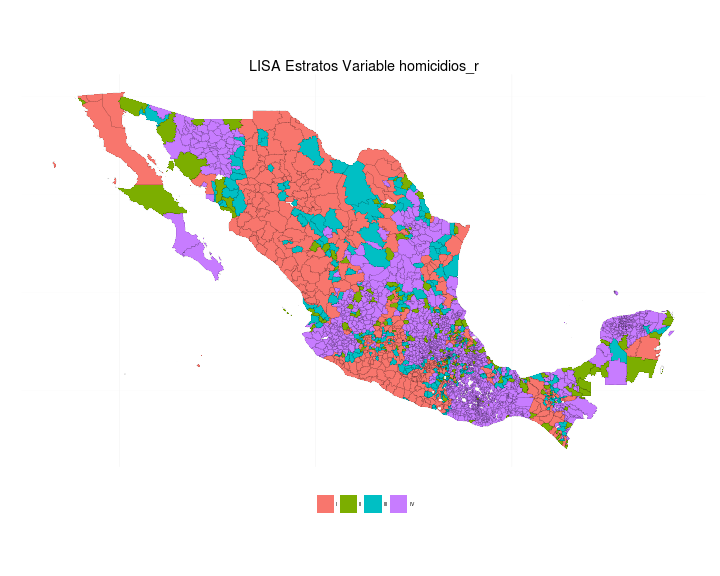
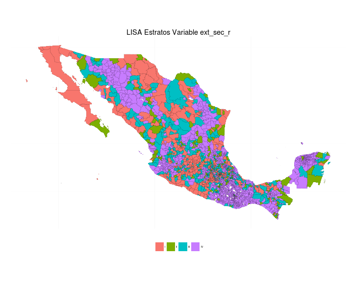
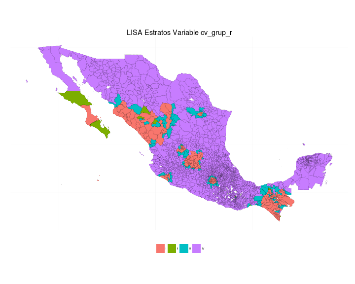
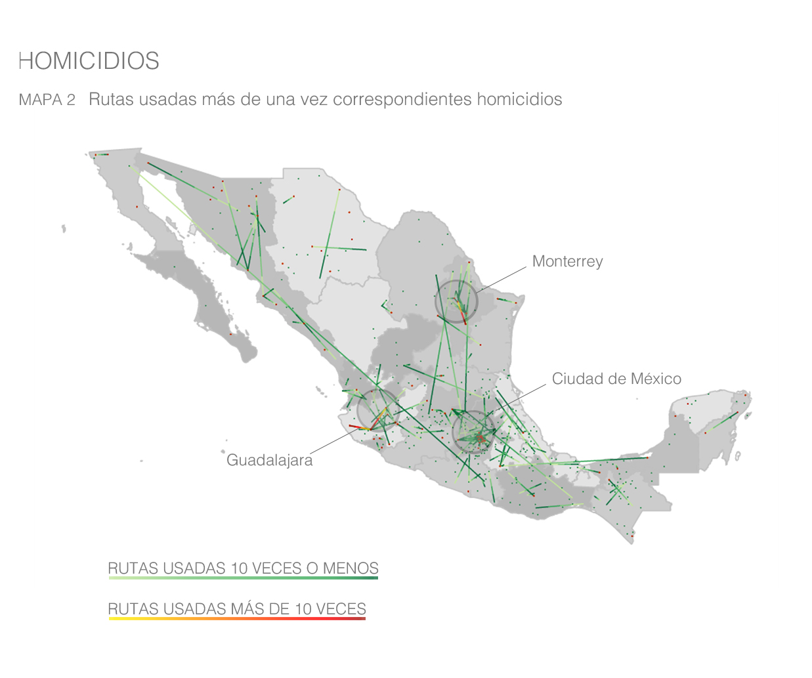
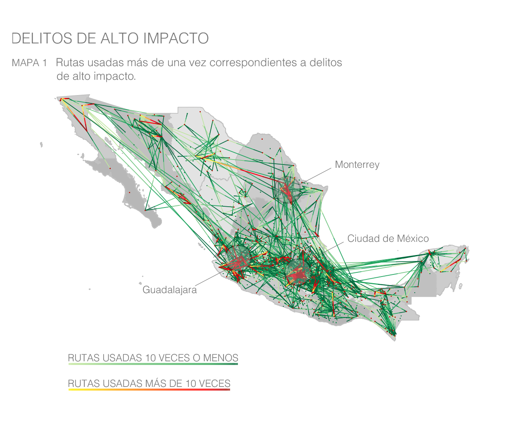

AARMS Summer School 2014
=========================================================
author: Jessica Barbosa
date: August 14, 2014
font-import: http://fonts.googleapis.com/css?family=Risque
font-family: 'Risque'

Me: pandorabob@gmail.com

This pres (*.Rpres): https://github.com/jbarbosat/mis-desmadres/tree/master/AARMS_2014

OPI: https://opi.la

  
Mexico
====================================================
- 32 states; 2,438 municipalities

**Problems:** Drug cartels, violence, corruption, inequality, water, energy...

OPI: Open Intelligence
====================================================

Equipping policymakers, academics and NGOs with the tools
and information they need to drive meaningful change
  1. Consulting
  2. Surveys
  3. Dashboard. Arquímedes.
  4. Government accountability. Pitágoras
  5. SEGOB (Mexican Ministry of the Interior)
    - Violence prevention

Question
===================================================
incremental: true

**What can we do about violence in Mexico?** `Y~X`

- **Y**: Crime statistics
  - Different variables available. Which to use?

- **X**: Everything we can get our hands on!
  - Feature extraction and selection
      - Statistics: infrastructure, socioeconomic info...
      - Social networks, web scrapping, surveys, ...

Y : Characterization of crime in Mexico
===================================================

- Different kinds of crime
  - Different patterns
  - Different preventive actions
- Classify crime 
    - Unsupervised 
- Geospatial analysis: 
    - Are the different kinds of crime spatially distributed at random?

Part 0: Variables
====================================================
- Rates per 100,000 people in municipalities for 2013.
  - Extortion
  - Intentional homicide *arma blanca* (knives) 
  - Intentional homicide *firearms* (guns) 
  - Kidnapping
  - Aggravated robbery: household
  - Aggravated robbery: people
  - Aggravated robbery: transport
  - Aggravated and non-aggravated robbery: vehicles
  - Violent shoplifting

Part 1: PCA. New variables for further analysis
=========================================================

- Homicides (more severe), 
- Kidnapping, non-violent vehicle, extortion (more organized)
- Other robbery

Part 2: Spatial Clustering?
=========================================================

- Three new variables, given by the PCA
- Are they spatially correlated?
   - Is it worth it to have a spatial model? 

Lags: Homicide
========================================================

Lags: "Organized" crimes
========================================================

Lags: Rest
========================================================

Maps: Four levels
========================================================

***
<tiny>
- RED: High locally, High neighbours
- GREEN: High locally, Low neighbours
- BLUE: Low locally, High neighbours
- PURPLE: Low locally, Low neighbours
</tiny>

Map: Homicide
========================================================

Map: "Organized" crimes
========================================================

Map: Rest
========================================================

Future work
========================================================

- **X**
    - Social networks
    - Web scrapping
    - Surveys

- **Y**
    - Better spatial analysis
    - Migration patterns of criminals

Migration patterns of criminals (Homicide)
========================================================

Migration patterns of criminals (Rest)
========================================================

The important stuff...
========================================================

- Hard getting data
- Hard to affect public policy making
- Software solutions + Analytic tools

- Open data? Open analysis!

- Academia, NGOs...

